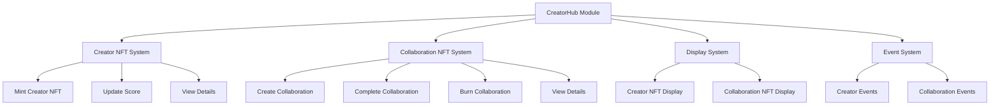
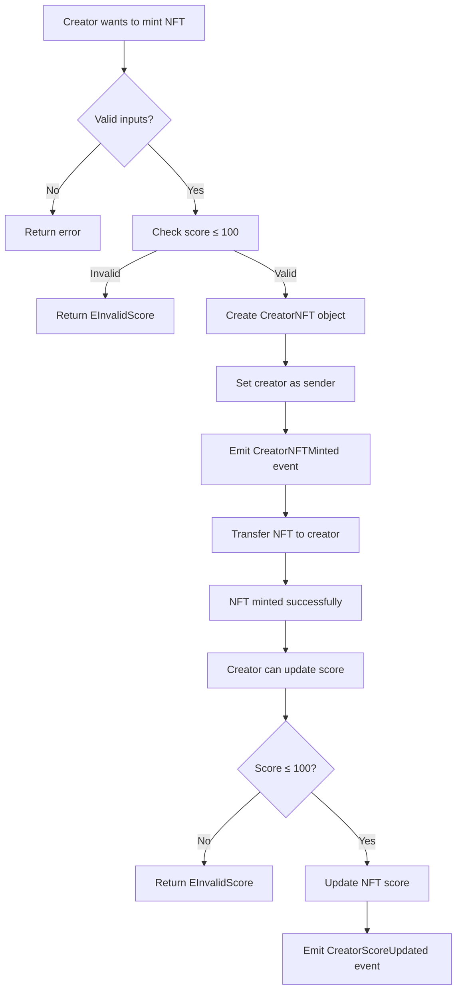
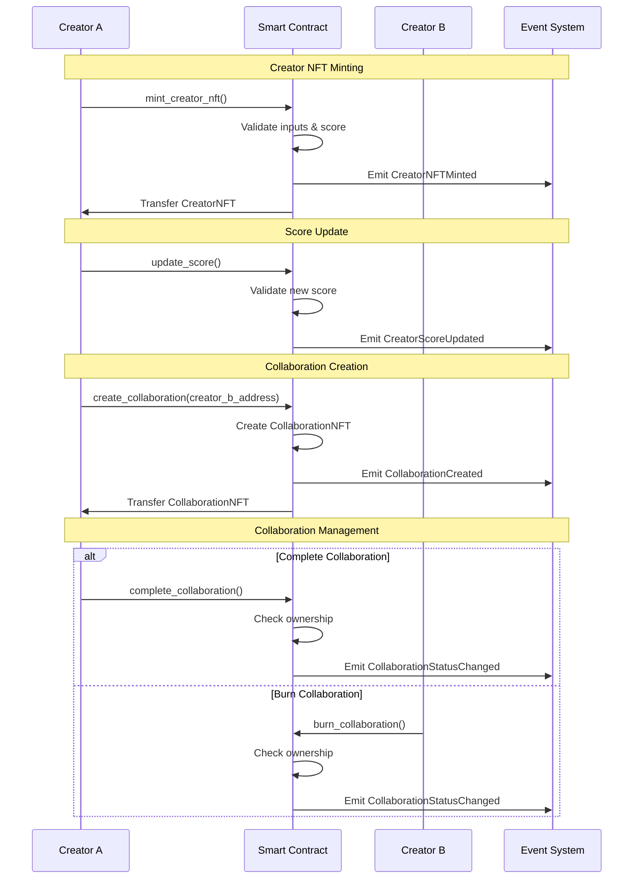
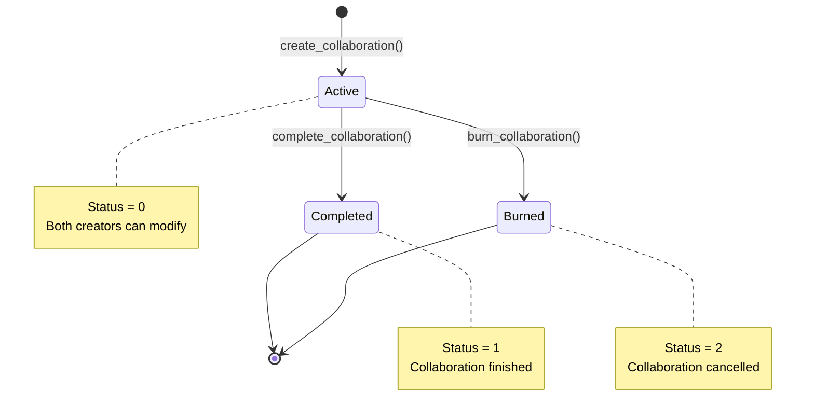

# CreatorHub Smart Contract

## Overview

CreatorHub is a Sui blockchain-based smart contract that enables content creators to mint NFTs representing their social media presence and establish collaborations with other creators. The contract supports two main NFT types: Creator NFTs and Collaboration NFTs.

## Architecture Overview



## Data Structures

### Creator NFT Structure
```
CreatorNFT {
    id: UID
    name: String
    platform: String (YouTube, Instagram, etc.)
    category: String (Gaming, Music, etc.)
    creator: address
    url: Url (image/avatar URL)
    score: u64 (0-100 rating)
    creation_time: u64
}
```

### Collaboration NFT Structure
```
CollaborationNFT {
    id: UID
    name: String
    creator_a: address (initiator)
    creator_b: address (collaborator)
    description: String
    url: Url (collaboration image)
    creation_time: u64
    status: u8 (0: active, 1: completed, 2: burned)
}
```

## Workflow Diagrams

### Creator NFT Workflow



### Collaboration NFT Workflow

```mermaid
flowchart TD
    A[Creator A wants collaboration] --> B[Provide collaboration details]
    B --> C[Create CollaborationNFT]
    C --> D[Set status = 0 (active)]
    D --> E[Set creator_a = sender]
    E --> F[Set creator_b = provided address]
    F --> G[Emit CollaborationCreated event]
    G --> H[Transfer to creator_a]
    
    H --> I{Collaboration action?}
    I -->|Complete| J{Sender is creator_a or creator_b?}
    I -->|Burn| K{Sender is creator_a or creator_b?}
    
    J -->|No| L[Return ENotOwner]
    J -->|Yes| M[Set status = 1 (completed)]
    M --> N[Emit CollaborationStatusChanged]
    
    K -->|No| O[Return ENotOwner]
    K -->|Yes| P[Set status = 2 (burned)]
    P --> Q[Emit CollaborationStatusChanged]
```

### Complete System Flow



## Key Functions

### Creator NFT Functions

| Function | Description | Access |
|----------|-------------|---------|
| `mint_creator_nft()` | Creates a new Creator NFT with platform and category info | Public Entry |
| `update_score()` | Updates the creator's score (0-100) | Public Entry |
| `get_creator_nft_details()` | Returns Creator NFT information | Public View |

### Collaboration NFT Functions

| Function | Description | Access |
|----------|-------------|---------|
| `create_collaboration()` | Creates a new collaboration between two creators | Public Entry |
| `complete_collaboration()` | Marks collaboration as completed | Public Entry |
| `burn_collaboration()` | Marks collaboration as burned | Public Entry |
| `get_collaboration_details()` | Returns collaboration information | Public View |

## Events

### Creator NFT Events
- **CreatorNFTMinted**: Emitted when a new Creator NFT is created
- **CreatorScoreUpdated**: Emitted when a creator's score is updated

### Collaboration NFT Events
- **CollaborationCreated**: Emitted when a new collaboration is established
- **CollaborationStatusChanged**: Emitted when collaboration status changes

## State Transitions

### Collaboration Status States



## Error Handling

| Error Code | Constant | Description |
|------------|----------|-------------|
| 0 | `EInvalidScore` | Score must be between 0-100 |
| 1 | `ENotOwner` | Only collaboration participants can modify status |

## Security Features

1. **Ownership Validation**: Only collaboration participants can modify collaboration status
2. **Score Validation**: Creator scores are restricted to 0-100 range
3. **Immutable Creator**: Creator address cannot be changed after NFT creation
4. **Event Logging**: All important actions are logged via events

## Usage Examples

### Minting a Creator NFT
```move
mint_creator_nft(
    b"CryptoGamer", 
    b"YouTube", 
    b"Gaming", 
    b"https://example.com/avatar.png", 
    85, 
    ctx
);
```

### Creating a Collaboration
```move
create_collaboration(
    b"Epic Gaming Collab",
    @0x456..., // creator_b address
    b"Joint gaming stream series",
    b"https://example.com/collab.png",
    ctx
);
```

## Display Configuration

The contract automatically configures display objects for both NFT types, making them compatible with Sui wallets and marketplaces. Display fields include:

- **Creator NFTs**: name, platform, category, score, creator address
- **Collaboration NFTs**: name, description, participating creators, status

## Integration

This smart contract can be integrated with:
- Sui wallets for NFT management
- Creator platforms for verification
- Collaboration marketplaces
- Analytics dashboards for tracking creator metrics
